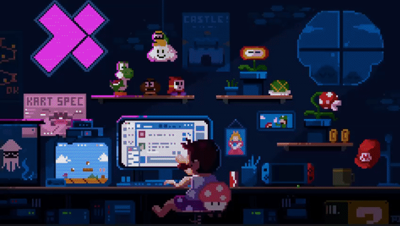
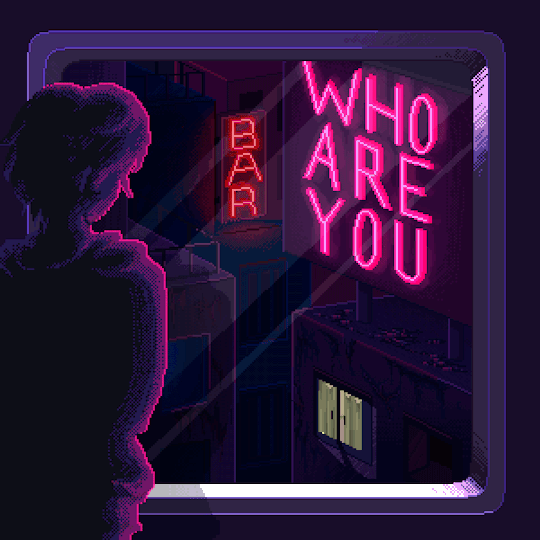

                        

<h2 align="center">📋&ensp; <i>Ｓｏｂｒｅ</i> &ensp;📋</h2>

<!-- <table align="center">
  <tr>
    <td>
      <b>
        <a href="README.md">🇧🇷 Português</a>
      </b>
    </td>
    <td>
      <a href="README-EN.md">🇺🇸 English</a>
    </td>
  </tr>
</table> -->
<ul align="left">
    <li>🤩️ Amante de Tecnologia, Jogos, Café, Anime e Lo-Fi 🤩️</li> 
    <li>🚀 Em processo de transição de carreira, sempre buscando conhecimento para poder avançar e me destacar no mercado de trabalho e assim alcançar minha tão sonhada primeira vaga como dev front-end 🚀</li> 
    <li>💻 Estudo na Faculdade <a href="https://www.iesb.br/" target="_blank">IESB</a> e na escola de formação de devs <a href="https://www.rocketseat.com.br/" target="_blank">Rocketseat</a>. Estou praticando <b>JavaScript</b> e <b>React</b> na Rocketseat, e <b>Python</b> na IESB 💻</li> 
    <li>🔮 Meu objetivo num futuro próximo, é me tornar desenvolvedor Front-End (talvez Fullstack) Web e Mobile 🔮</li> 
</ul>
 

<h2 align="center">🛠️&ensp; <i>Ｔｅｃｎｏｌｏｇｉａ</i> &ensp;🛠️</h2>

<table align="right" height="300px">
  <tr>
    <td align="center">
       
      
        <b>
          <pre>VSCode</pre>
        </b>
      
    </td>
    <td align="center">
       
      
        <b>
          <pre>HTML</pre>
        </b>
      
    </td>
    <td align="center">
       
      
        <b>
          <pre>&ensp;CSS&ensp;</pre>
        </b>
      
    </td>
    <td align="center">
       
      
        <b>
          <pre>JavaScript</pre>
        </b>
      
    </td>
    <td align="center">
       
      
        <b>
          <pre>React</pre>
        </b>
      
    </td>
  </tr>
  <tr>
    <td align="center">
       
      
        <b>
          <pre>Vite</pre>
        </b>
      
    </td>
    <td align="center" width="100px;">
       
      
        <b>
          <pre>&emsp;GitHub&emsp;</pre>
        </b>
      
    </td>
    <td align="center" width="100px;">
       
      
        <b>
          <pre>&emsp;Git&emsp;</pre>
        </b>
      
    </td>
    <td align="center">
       
      
        <b>
          <pre>Figma</pre>
        </b>
      
    </td>
    <td align="center">
       
      
        <b>
          <pre>Markdown</pre>
        </b>
      
    </td>
  </tr>
<!--<td align="center">
       
      
        <b>
          <pre>Yarn/npm</pre>
        </b>
      
    </td>
  </tr>
  <tr>
    <td align="center">
       
      
        <b>
          <pre>TypeScript</pre>
        </b>
      
    </td>
    <td align="center">
       
      
        <b>
          <pre>Tailwind</pre>
        </b>
      
    </td>
    <td align="center">
       
      
        <b>
          <pre>NodeJS</pre>
        </b>
      
    </td>
    <td align="center">
       
      
        <b>
          <pre>Terminal</pre>
        </b>
      
    </td>
  </tr>
  <tr>
    <td align="center">
       
      
        <b>
          <pre>Insomnia</pre>
        </b>
      
    </td>
  </tr>-->
</table> 
               

<h2 align="center">💬&ensp; <i>Ｃｏｎｔａｔｏ</i> &ensp;💬</h2>

  

  
   
   
  
  
  
  

   

<h2 align="center">👨🏻‍💻&ensp; <i>Ｐｒｏｊｅｔｏｓ</i> &ensp;👨🏻‍💻</h2>

<table height="495px" width="365px">
  <tr>
    <td>
    
    </td>
  </tr>
  <tr>
    <td>
    
    </td>
  </tr>
  <tr>
    <td>
    
    </td>
  </tr>
  <tr>
    <td>
    
    </td>
  </tr>
  <tr>
    <td>
    
    </td>
  </tr>
  <tr>
    <td>
    
    </td>
  </tr>
  <tr>
    <td>
    
    </td>
  </tr>
  <tr>
    <td>
     
    </td>
  </tr>
  <tr>
    <td>
    
    </td>
  </tr>
  <tr>
    <td>
    
    </td>
  </tr>
  <tr>
    <td>
    
    </td>
  </tr>
  <tr>
    <td>
    
    </td>
  </tr>
  <tr>
    <td>
    
    </td>
  </tr>
  <tr>
    <td>
    
    </td>
  </tr>
  <tr>
    <td>
    
    </td>
  </tr>
  <tr>
    <td>
    
    </td>
  </tr>
  <tr>
    <td>
    
    </td>
  </tr>
  <tr>
    <td>
    
    </td>
  </tr>
</table>
 

<h2 align="center">

📈&ensp; <i>Ａｔｉｖｉｄａｄｅ</i> &ensp;📈

 

 

